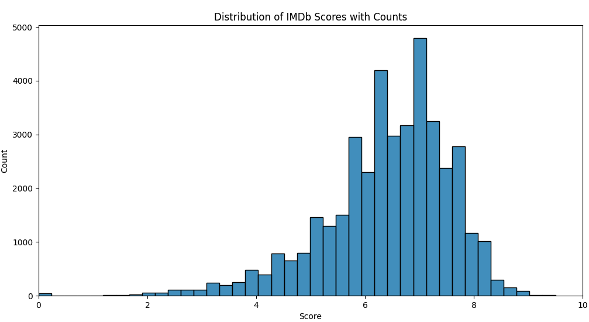

# README.md

## Quick start - Run if you already have the required dependencies

```bash
python main.py --help # You can see the parameter details.
python main.py -d <dir> -f <file_name>.csv

python -m unittest discover -s tests -p 'test_*.py' -v
```

### Run the application with `poetry`

```bash
curl -sSL https://install.python-poetry.org | python3 -

poetry --version # check if installed
poetry self update # update

# configure poetry to create virtual environments inside the project\'s root directory
poetry config virtualenvs.in-project true

# specify the python version for the local directory using pyenv
pyenv local 3.10.9

poetry init

# install libraries
poetry install

##
# activate the virtual environment and run a python file
poetry shell

python main.py --help # You can see the parameter details.
python main.py -d <dir> -f <file_name>.csv
```

## Test

- More tests can be added. e.g. We can also test the uniqueness etc. as a part of the unit testing.
- For the purpose of a task, tests are given as an example here.

```bash
# You can run the test with poetry.
# poetry run python -m unittest discover -s tests -p 'test_*.py' -v OR
poetry shell
python -m unittest discover -s tests -p 'test_*.py' -v

deactivate # close the virtual environment
```

## Example run

```markdown
-Task #1-----------------------------------------------------------

Total number of the movies: 40108

-Task #2-----------------------------------------------------------

Average score of all movies given scores: 6.41

---------

Top 3 movies:

       imdbId                           Imdb Link                  Title  IMDB Score                     Genre                                             Poster
17623  252487  http://www.imdb.com/title/tt252487  Hababam Sinifi (1975)         9.5           [Comedy, Drama]  https://images-na.ssl-images-amazon.com/images...
7356   185906  http://www.imdb.com/title/tt185906       Band of Brothers         9.5  [Action, Drama, History]  https://images-na.ssl-images-amazon.com/images...
38499  795176  http://www.imdb.com/title/tt795176           Planet Earth         9.5             [Documentary]  https://images-na.ssl-images-amazon.com/images...

-Task #3-----------------------------------------------------------

Movies selected by Animation genre:
        imdbId                            Imdb Link                                         Title  IMDB Score                           Genre                                             Poster
0       114709   http://www.imdb.com/title/tt114709                              Toy Story (1995)         5.0  [Animation, Adventure, Comedy]  https://images-na.ssl-images-amazon.com/images...
12      112453   http://www.imdb.com/title/tt112453                                  Balto (1995)         7.1   [Animation, Adventure, Drama]  https://images-na.ssl-images-amazon.com/images...
47      114148   http://www.imdb.com/title/tt114148                             Pocahontas (1995)         6.7   [Animation, Adventure, Drama]  https://images-na.ssl-images-amazon.com/images...
236     113198   http://www.imdb.com/title/tt113198                          A Goofy Movie (1995)         6.8  [Animation, Adventure, Comedy]  https://images-na.ssl-images-amazon.com/images...
241     113234   http://www.imdb.com/title/tt113234                       Gumby: The Movie (1995)         6.2  [Animation, Action, Adventure]  https://images-na.ssl-images-amazon.com/images...
...        ...                                  ...                                           ...         ...                             ...                                                ...
40030  4955162  http://www.imdb.com/title/tt4955162               Barbie in Rock 'N Royals (2015)         5.7             [Animation, Family]  https://images-na.ssl-images-amazon.com/images...
40031  5042436  http://www.imdb.com/title/tt5042436                      Barbie: Spy Squad (2016)         5.5             [Animation, Family]  https://images-na.ssl-images-amazon.com/images...
40065  5973626  http://www.imdb.com/title/tt5973626  Batman: Return of the Caped Crusaders (2016)         7.0  [Animation, Action, Adventure]  https://images-na.ssl-images-amazon.com/images...
40081  1679335  http://www.imdb.com/title/tt1679335                                 Trolls (2016)         6.5  [Animation, Adventure, Comedy]  https://images-na.ssl-images-amazon.com/images...
40085  4189294  http://www.imdb.com/title/tt4189294    Lego DC Comics: Batman Be-Leaguered (2014)         6.8      [Animation, Short, Action]  https://images-na.ssl-images-amazon.com/images...

[1750 rows x 6 columns]

-----

Unique genres: Animation, Adventure, Comedy, Action, Family, Romance, Drama, Crime, Thriller, Fantasy, Horror, Biography, History, Mystery, Sci-Fi, War, Sport, Music, Documentary, Musical, Western, Short, Film-Noir, Talk-Show, News, Adult, Reality-TV, Game-Show.

-Task #4-----------------------------------------------------------

Movie is updated as:

   imdbId                           Imdb Link             Title  IMDB Score                       Genre                                             Poster
0  114709  http://www.imdb.com/title/tt114709  Toy Story (1995)         5.0  Animation|Adventure|Comedy  https://images-na.ssl-images-amazon.com/images...

-----

Recommended movie:

imdbId                                                   213338
Imdb Link                    http://www.imdb.com/title/tt213338
Title                                              Cowboy Bebop
IMDB Score                                                  9.0
Genre                                                 Animation
Poster        https://images-na.ssl-images-amazon.com/images...
Name: 23537, dtype: object

-Task #5-----------------------------------------------------------

The plot shows the rating distribution.
Data distribution will look like a normal distribution if there is enough data.
-------------------------------------------------------------------
```



---

#### P.S.

- Python libraries dealing with data make the program more efficient and easier to implement, such as `pandas`, `numpy` etc. However, this project can be done without these libraries. If you want me to do this way, I can code and share the other solution.
