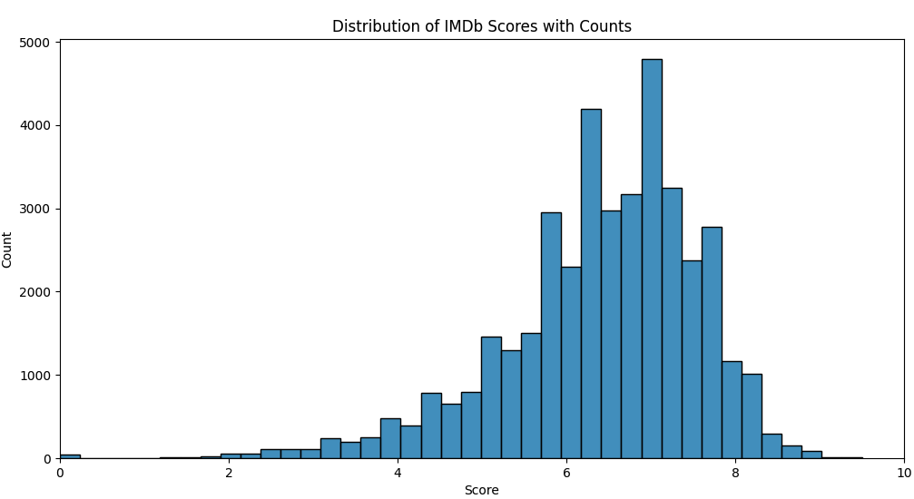

# Movie Dataset Analysis

[](https://www.python.org/)
[](https://python-poetry.org/)
[](https://github.com/fatmakahveci/alma_task/commits/main)
[](LICENSE.md)

A command-line Python project that explores a movie dataset through loading, cleaning, aggregation, filtering, record updates, recommendations, and rating visualization.

## What It Does

The analysis is organized into five focused tasks:

1. Load and clean the movie CSV data.
2. Calculate aggregate statistics and list the highest-rated titles.
3. Filter movies by genre and report the available genres.
4. Update a selected record and recommend a related movie.
5. Generate a rating-distribution chart.

The generated chart is saved as `images/rating_dist.png`, while execution details are written to `movies.log`.

## Requirements

- Python 3.10 or newer
- [Poetry](https://python-poetry.org/) for dependency management
- A `movies.csv` dataset containing the columns used by the task modules, including `imdbId`, `Title`, `IMDB Score`, and `Genre`

The CLI reads the file selected by `--dir` and `--file`. Missing files are rejected
before any task runs. The filename must not contain a directory component.

## Getting Started

```bash
git clone https://github.com/fatmakahveci/alma_task.git
cd alma_task
poetry install --no-root
poetry run python main.py --dir "$HOME/Downloads" --file movies.csv
```

The analysis libraries are declared in `pyproject.toml` and resolved in `poetry.lock`.

View all command-line options:

```bash
poetry run python main.py --help
```

## Testing

```bash
poetry run python -m unittest discover -s tests -p 'test_*.py' -v
```

## Project Structure

```text
.
├── main.py              Application entry point and task orchestration
├── constants.py         Dataset path and analysis defaults
├── utils.py             CSV loading, cleaning, and CLI helpers
├── tasks/               Five independent analysis stages
├── tests/               Unit tests
└── images/              Generated and documented visualizations
```

## Example Output

The program reports the record count, average score, top-rated titles, genre-filtered results, and a related recommendation. The included sample visualization shows the resulting rating distribution:



## Contributing

See the [contributing guide](.github/CONTRIBUTING.md) before proposing a change. Include tests for modifications to data cleaning or analysis behavior.

## Project Resources

- [Changelog](CHANGELOG.md)
- [Security policy](.github/SECURITY.md)
- [License](LICENSE.md)
